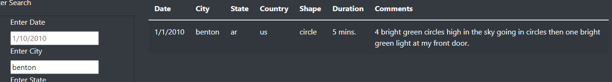
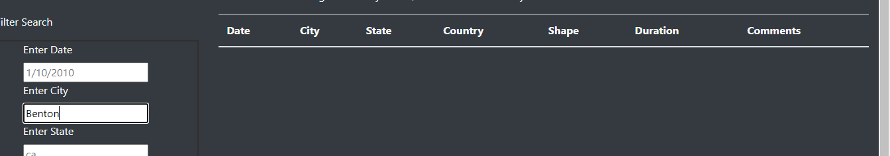

# UFOs

The purpose of this analysis was to create a functional website to display UFO sightings data. We created a website and placed the data on the page in a table then created a filter so that the users could filter out the table to view the data they wanted. In addition to the date filter, we created we added other parameters for the users to search the data by. For this challenge we added a text box for the user to search by city, state, country, and shape in addition to the date parameter. 

As soon as the user accesses the website, the user can either scroll though the table manually or can enter and text in the textbox provided. Each textbox has a placeholder so that the user can enter whatever parameter they want but should enter it exactly like the text is showing. For example, if you wanted to search for UFO sightings located in the city of Benton, the user would have to type Benton starting with a lower case “b” or else the search criteria will not show the correct information. You can see this in the images below. 

One drawback of this page is that like I stated in the instructions on how to search the criteria, the search parameters is case sensitive. if there were no instructions on how to use this page. The user would have to waste time trying to figure out why the text search isn’t working or could think that there is no data on their particular search. Usually the first letter in cities and states are capitalized. Another drawback of this page is that the user isn’t able to filter out the data based on keywords that are located in the comments section of the table. For example, in the table, in the fresno, ca the description under the shape column has “light”. Light is not a shape. If there was a text box that allowed the user to enter keywords such as “bright lights”, the user would be able to refine their search to get the most accurate data possible. 
